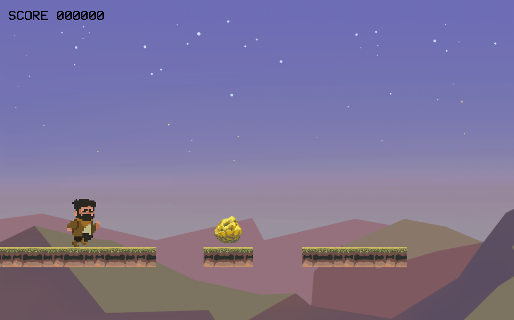

# goldRush
Concept for a Gold-Rush themed infinite runner, a project for Isaac Pante's class "Dévelopement de jeux-vidéos 2D"

## Description
This project is themed after the famous 19th century Gold Rushes which took place in the US. 
* Try to collect as many nuggets of gold as you can!
* All while avoiding deadly spikes, and bottomless pits. 
* You've got a double jump at disposal, time both jumps well !!
* Or suffer a great loss, and start over.
## Disclaimer
* Game developed fpr Phaser 3.
* All the designs and pixel art were drawn by glhanmos (me).
* The main part of the code was developed by Emanuele Feronato, borrowed from his amazing tutorial on how to make an infinite runner, which you can find linked below:
https://bit.ly/2Eg6MPO
* My coding contributions include a score banner, a few animation tweaks and a gameover scene with a final score.
## Installation
* This game can be played through VSCode's "Live Server" extension.
## Context of Development
The project was made for the validation of the class "Développement de jeux-vidéos 2D" taught by Isaac Pante (SLI, Lettres, Unil).
